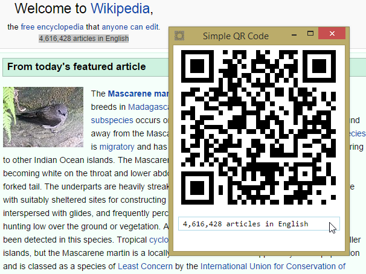
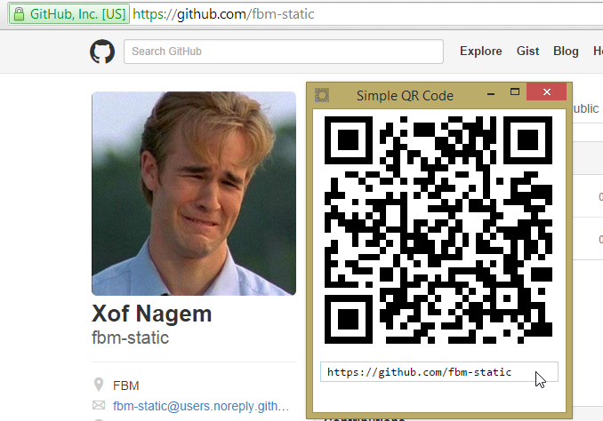
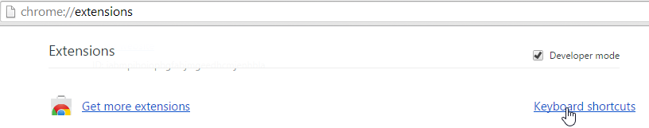
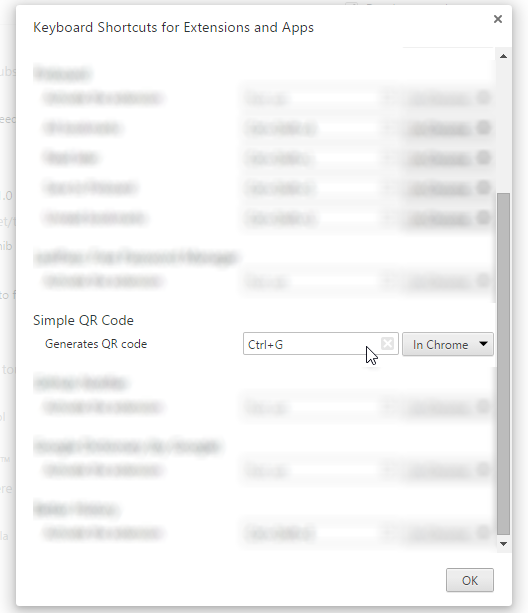

Simple QR Code
---

Generate QR codes from the selected page on a web page, if none, use the current tab's URL. As simple as that. Does not use any external APIs to generate the QR code images so it saves you your previous bandwidth.

## Usage

#### either select a piece of text, press the hotkey

####  or go to a page, press the hotkey

## Hotkey

The hotkey could be configured by going to `chrome://extensions`

